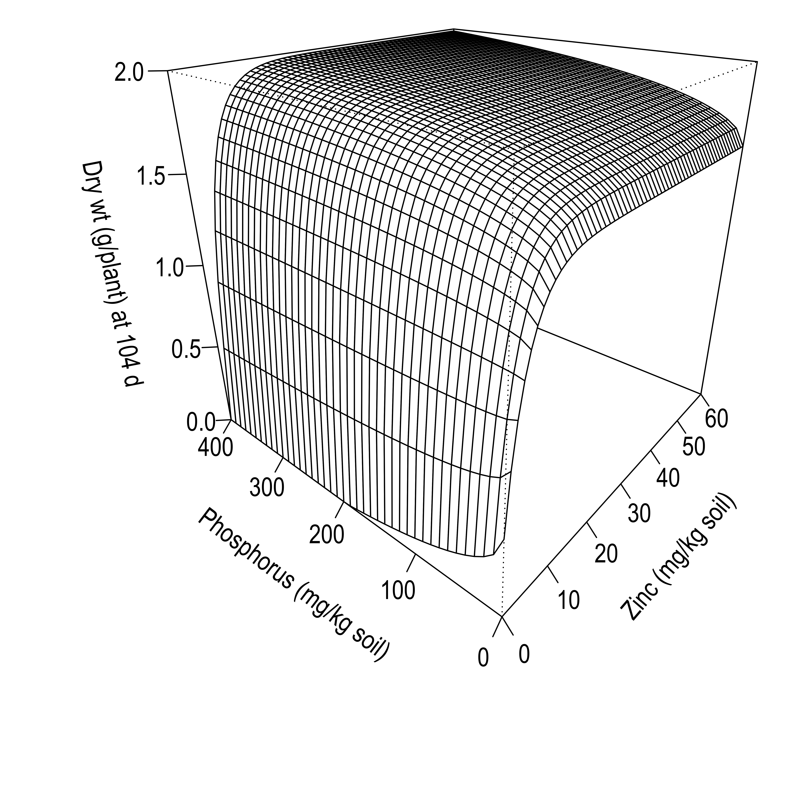

# Code for 3D Wireframe Figure from Seymour _et al._ 2019

  <!-- badges: start -->

  <!-- badges: end -->

This repository hosts the R script, [surface_plot.R](surface_plot.R), used to create Figure 5 as found in Seymour et al. 2019.

 

> Seymour, N.P., Edwards, D.G. & Thompson, J.P. A dual rescaled Mitscherlich model of the simultaneous savings in phosphorus and zinc fertiliser from arbuscular mycorrhizal fungal colonisation of linseed (_Linum usitatissimum_ L.). Plant Soil 440, 97–118 (2019). [https://doi.org/10.1007/s11104-019-04065-2](https://doi.org/10.1007/s11104-019-04065-2)

## License

[CC0 1.0 Universal](LICENSE.md)
